# ANALYZING NETFLIX DATA FOR BUSINESS INSIGHTS

_Project Time frame: 17/04/2023–22/04/2023_

     Photo by Thibault Penin on Unsplash

## INTRODUCTION

Founded by Reed Hastings and Marc Randolph in 1977, the streaming giant started out by selling and renting DVDs by mail. Though the sale of DVDs stopped after a year, the rental service continued. Over the years, Netflix has evolved to be one of the top three largest entertainment companies by market capitalization having over 200 million subscribers across 190 countries with 17,000 titles and still counting across all its international libraries. The streaming platform has an array of movies and TV shows, some of which are Netflix originals while others are licensed content.

For this project, I was tasked with conducting an exploratory data analysis on Netflix’s content library that would help the media company make informed business decisions.

## DATA SOURCE

Data was gotten from Kaggle and can be assessed here. The data has 8807 rows and 12 columns.

### Project Objectives

1. Identify the most popular shows and movies on Netflix based on viewership data.
2. Analyze viewer behavior and preferences to understand which genres and types of content are most popular.
3. Investigate the relationship between user ratings and viewership data to understand how ratings impact viewership.
4. Evaluate the performance of Netflix’s original content versus licensed content.
5. Identify potential areas for growth and expansion for the company.

The task was to provide answers to the above objectives. However upon careful study of the data, viewership data was not present, also there was no indication of which content was original and which was licensed, hence I could not answer the first four questions based on the dataset provided. In lieu of that, I sought to answer the following questions:

1. How many movies and Tv shows are listed in the Netflix library?
2. What Genre are Movies and Tv shows categorized by?
3. What is the percentage distribution of movies and TV shows?
4. How has Netflix content increased over the years from 2008?
5. What is the Geographical distribution of content on Netflix?
6. Which country has the most Tv shows and movies?
7. Are movies and Tv shows added to the library on weekdays or weekends?
8. What is the average duration of movies and Tv shows?
9. What is the longest Movie and Tv show with the highest number of seasons?
10. What is the audience rating for content on Netflix?

### Data Structure

The data contains shows listed on Netflix from 2008–2021. The rows are 8807 excluding the headers and it has 12 columns.

The columns are:

- Show_id: A unique identification of each show beginning with s1.
- Type: Identifies whether the content is a Movie or TV Show.
- Title: Title of the Movie or Tv show.
- Director: Director(s) of each movie or Tv show.
- Cast: Names of Actors/Actresses.
- Country: Country/Countries where it was made.
- Date_added: The date it was listed on Netflix.
- Release_year: The year the movie or Tv show was released.
- Rating: The rating of the Movie or Tv show.
- Duration: How long the movie or Tv show lasted.
- Listed_in: The Genre the Movie or Tv show belongs to.
- Description: A brief description of what the Movie or Tv show is about.

## DATA CLEANING

The data had so many inconsistencies and blank cells. The following steps were taken to clean the data:

- Movies or TV shows that had dates as their title was formatted as a text of date. This was corrected by formatting the dates as text using the TEXT() in Excel.
- Movies and TV shows that had numbers as titles were properly formatted as text.
- Blank cells were replaced with U/A (Unavailable).
- Mins and seasons were separated from duration just to have only the figures.
- The weekday() in Power BI was used to determine if a movie or Tv show was released on a weekday or weekend.

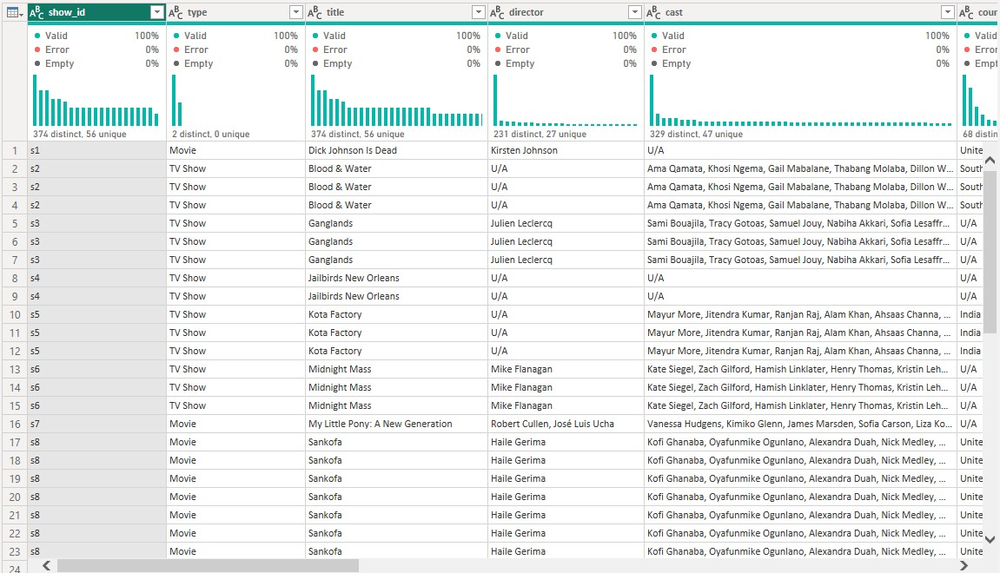

    Power Query View on Power BI

## DATA ANALYSIS AND VISUALIZATION

In this step, I carried out an exploratory analysis of the data to answer the questions that were stated earlier.

First of all, I did a quick summary to determine the total shows(both movies and Tv shows), the total number of movies, the total number of tv shows, and the total genre that the shows are listed.

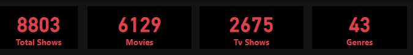

      Summary of Data (Key Performance Indicator)

From this analysis, it is seen that movies are listed more on the Netflix library compared to Tv shows. The number of movies is almost three times the number of Tv shows available. Also, there are 43 unique Genres that the movies or Tv shows are categorized by.

### Question 1
What is the percentage distribution of Movies and Tv shows?

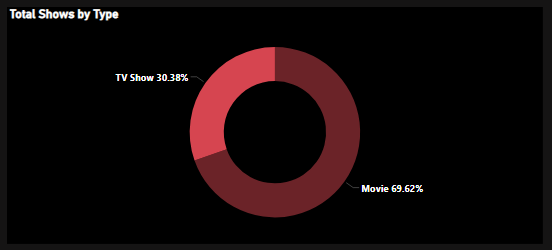

       Show Distribution by Show Type

Movies present have a percentage distribution of 69.6% while Tv shows have 30.3%. This implies that there are more movies than TV shows.

### Question 2
How has Netflix Content increased over the years since 2008?

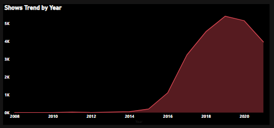             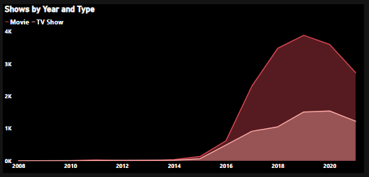

       Show Trend by Year

Netflix began streaming content in 2007, however, the data we have began from 2008. From this analysis, we could see that not so much content was listed in the early days. Content began to increase significantly in 2015 and there was a peak in 2019 with a total show of 5,406 added to the Netflix library irrespective of whether it is a Movie or Tv show. Also, every year, movies are listed more than Tv shows.

### Question 3
What is the Geographical distribution of content on Netflix?

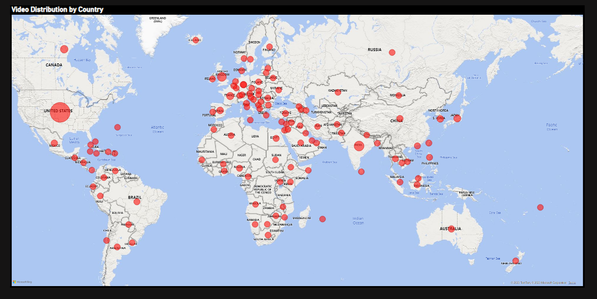

       Map Visual showing Show distribution by Location

The United States has the most content on Netflix. It has a total of 3688 videos

### Question 4
What are the top 10 countries with the most Movies and Tv shows?

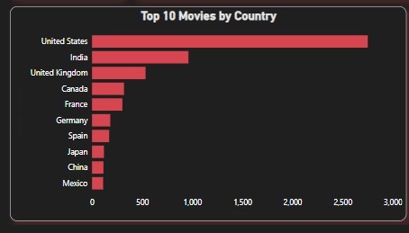    

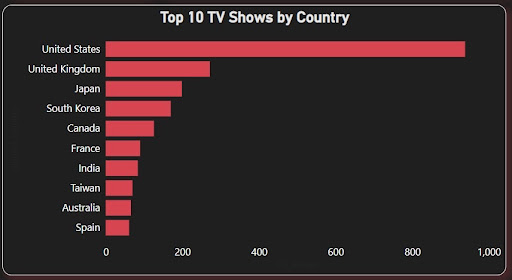

       Top Netflix Contents by Country

The United States has the most content on Netflix, be it Movies or Tv shows.

### Question 5
Next, I determined the top 10 Genre that both Movies and Tv shows are listed in

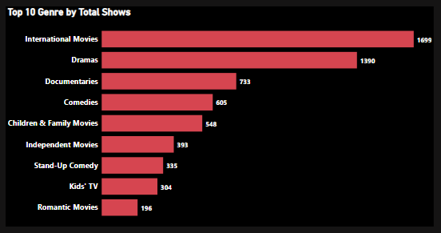

     Shows by Genre
From this analysis, it was discovered that the International movie Genre has the highest number of Movies and Tv shows, followed by Dramas and the third is Documentaries.

### Question 6
Furthermore, I wanted to know if movies and Tv shows are released more on weekends compared to weekdays.

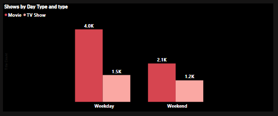

    Shows by Day Type and Content Type

From this analysis, I discovered that both Movies and Tv shows were released more on Weekdays compared to weekends.

### Question 7
I went ahead to determine the average duration of Movies (in minutes) and Tv shows (in seasons). Also, I determined the Movie with the longest duration and the Tv show with the most seasons.

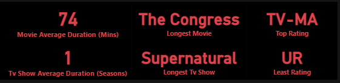

     Top and Least Shows by Duration, Show Type, and Rating

73.80 mins is the average duration of Movies while 0.51 is the average season for Tv shows. The Congress is the longest movie while Supernatural is the Tv show with the most seasons.

### Question 8
Next, I determined how Movies and Tv shows are rated and what audience they are tailored for.

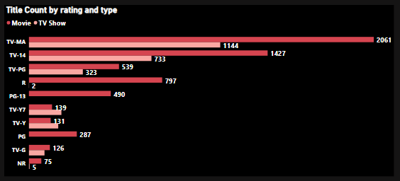

     Shows by Rating and Show Type

TV-MA leads for both Movies and Tv shows, giving an indication that this content is only suitable for mature audiences only. Interestingly, TV-14 and TV-PG which are the second and third respectively require parental guidance for viewers younger than 17 as there may be unsuitable content for this age group. This shows that most Netflix contents are not to be viewed by those younger than 17. Parents should definitely take note.

## INSIGHTS

- There are 8,803 shows that have been added to Netflix between 2008 — 2021. The movie category has the highest with 6,129 (69.62%) and TV Shows with 2,675 (30.38%).
- The total number of genres of shows on Netflix is 43 which International Movies genre has the highest number of shows (1,699) and Dramas have 1,390 videos.
- The videos contain different contents giving them different TV ratings. Out of all videos, 3,205 have a TV-MA rating (Mature Audience) and 2,160 videos have a TV-14 (For 14 years & Older) TV rating.
- More movies, 4,000, and TV shows, 1,500, are uploaded during weekdays than on weekends.
- More videos were added on Netflix starting from 2014 (55) till 2021 (3,963). The highest number of videos were uploaded in 2019 (5,406).
- The United States of America has the highest number of videos (3,688)added on Netflix followed by India (1,046).

## RECOMMENDATIONS

- Netflix has its headquarters in The United States of America which has influenced the larger percentage of videos coming from the country. It is recommended that Netflix should consider expanding its operations in other countries such as India which has the second-highest number of videos uploaded.
- Netflix should also look into listing videos/content that are safe for viewers below 17 years of age. It will ease the worries of the parent about their children accessing those contents/videos.
- As more videos from Europe and North America are uploaded, Netflix should consider uploading videos from African countries.
- Considering other sources of videos and content will maintain the upward trend of videos added over the years.

## CONCLUSION

In conclusion, my analysis of the Netflix data has provided me with valuable insights that can help the company improve its show coverage and customer satisfaction. By following data-driven recommendations, Netflix can differentiate itself from competitors and provide its customers with the best content based on the customers’ preferences.

You can interact with the dashboard [here](https://app.powerbi.com/view?r=eyJrIjoiNGQ5NDJlYzktNzA5YS00MjE4LTg5ZDYtMzU5NjU4MGQxOGUxIiwidCI6Ijk2NDA1NDAwLWI5ZWEtNGQ2My05MDcyLTk4Zjk2OTJmM2VmOCJ9)

It was a great experience working on this project. I hope you learned as you explore the documentation and interact with the dashboard. Let me know what you think!

     photo by Julie Blais Comeau

_Your feedback is very important to my growth as a data analyst. Follow for more exciting data analytics projects from PsycheXAnalyst_
